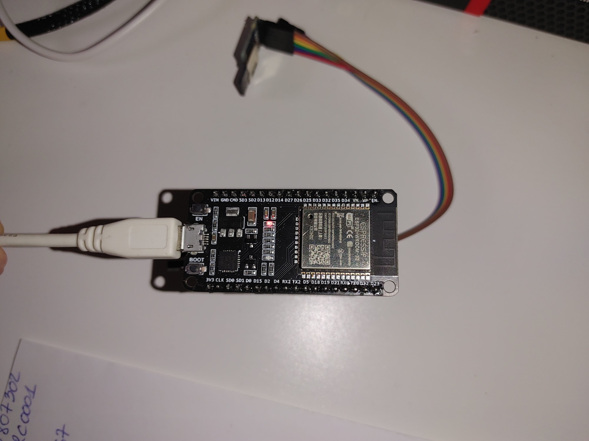

# ESP32-FileServer-ESP-IDF

![ESP32 File Server with SD card]

    

    <ul>
        <li>D15 -> MOSI</li>
        <li>D4 -> MISO</li>
        <li>D13 -> CS</li>
        <li>D14 -> CLK</li>
    </ul>

D15 -> MOSI

D4 -> MISO

D13 -> CS

D14 -> CLK

